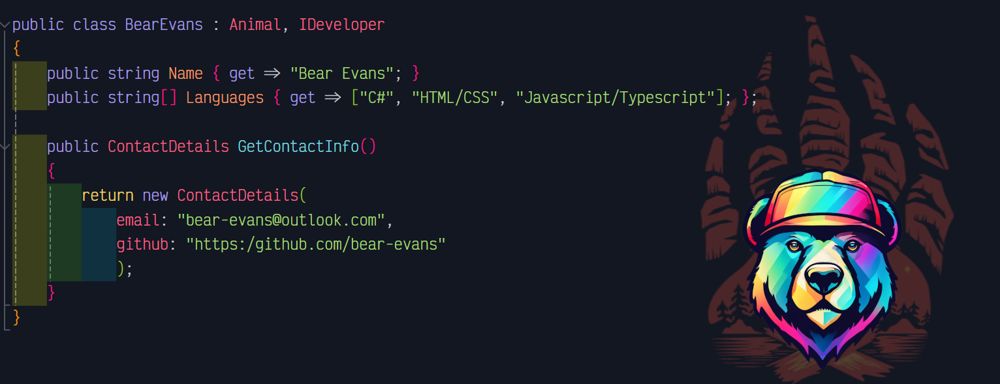

   

Bear is a full-stack web developer, writer, and gaming enthusiast from Ohio State University. His ideal project includes crisp design, well-commented code, and fun problems to solve. When not writing code, he spends his time weightlifting, brewing ciders, and talking about himself in the third person.

His portfolio can be found <a href="https://bear-evans.github.io/portfolio/">here</a>.

## 🐻 More Bear Bites 🐻

- Bear obtained a certificate from the OSU Digital Bootcamp.
- Bear writes about his coding adventures on his <a href="https://bear-evans.hashnode.dev/">blog</a>.
- He even has a <a href="https://docs.google.com/document/d/1OMPMXa_rnMUbPA0EmieLSSL9zN1gF_hok8jmKR1xD0Y/edit?usp=sharing">resume</a>!

## ⚒️ Languages and Tools I Use ⚒️

